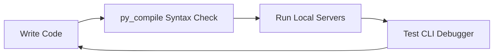
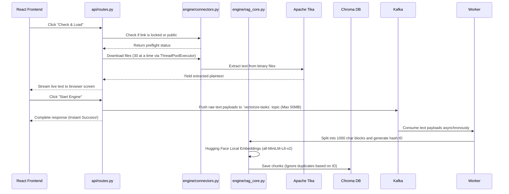
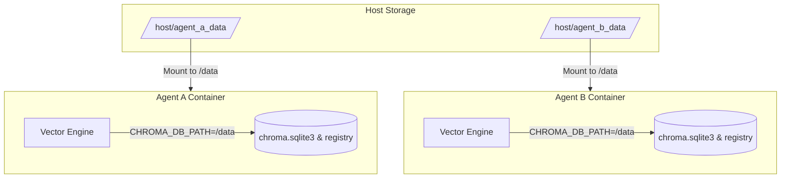

# VoiceLatex Google Drive Vector Engine: Development & Production Workflow

This document explains the standard workflows for developing, running, testing, and deploying the Google Drive Vector Engine subsystem.

---

## 1. Local Development Workflow

Follow this loop when adding new features (e.g. new file parsers, alternative vector stores, or prompt adjustments):



### Syntax Verification
Before committing or testing code, compile all files to verify syntax correctness:
```bash
python -m py_compile engine/connectors.py engine/rag_core.py api/routes.py main.py debug_query.py check_chroma.py tests/check_master.py
```

### Prompt Engineering
To modify the behavior or tone of the answering bot, edit the prompt template in [engine/rag_core.py](engine/rag_core.py):
```python
prompt = ChatPromptTemplate.from_messages([
    ("system", "Your custom instructions go here..."),
    ("human", "{question}")
])
```

---

## 2. Ingestion & Vectorization Workflow

When the frontend submits a document url, the system processes it as follows:



---

## 3. Query & Retrieval Workflow

Queries to the `/query` endpoint run the following steps:

1. **Embedding generation**: The query string is embedded into a high-dimensional vector exactly once using local Hugging Face.
2. **Direct database search**: The engine queries the `MASTER_COLLECTION` in ChromaDB, applying a `$in` namespace filter, using L2 distance similarity metrics. It fetches the top 8 absolute best matching text chunks for the allowed folders.
3. **Prompt construction**: Extracted text chunks are concatenated into a structured markdown block and wrapped securely inside `<context>` XML tags to prevent prompt injection.
4. **Answering**: The prompt is processed by `gpt-4o-mini` to stream or return the answer.

---

## 4. Multi-Agent Deployment Workflow (Subsystem Isolation)

Since this subsystem is embedded into individual agents, use the `CHROMA_DB_PATH` environment variable to isolate storage folders.



### Step-by-Step Isolation Set Up:
1. Define a persistent mount path for each agent on the host filesystem (e.g. `/var/data/agent_1`).
2. Build the docker image:
   ```bash
   docker build -t voicelatex-gdrive-engine .
   ```
3. Boot the container supplying the specific mount and path variable:
   ```bash
   docker run -d \
     -p 8001:8000 \
     -v /var/data/agent_1:/app/local_chroma_db \
     -e OPENAI_API_KEY="sk-..." \
     -e CHROMA_DB_PATH="/app/local_chroma_db" \
     --name agent_1_engine \
     voicelatex-gdrive-engine
   ```
   This isolates `namespaces_registry.json`, `chroma.sqlite3`, and `index` files completely to the `/var/data/agent_1` path.

---

## 5. Diagnostics & Maintenance Workflow

### Standalone Query Checking
Run raw query tests using the CLI utility:
```bash
# Power Shell env setup
$env:CHROMA_DB_PATH="./local_chroma_db/agent_1"
python debug_query.py
```

### Storage Vacuuming
When removing namespace items via `/purge`, the system automatically runs the `VACUUM` SQL statement to release free pages and shrink SQLite files:
```python
conn = sqlite3.connect("/app/local_chroma_db/chroma.sqlite3")
conn.execute("VACUUM")
```
No manual intervention is needed.
